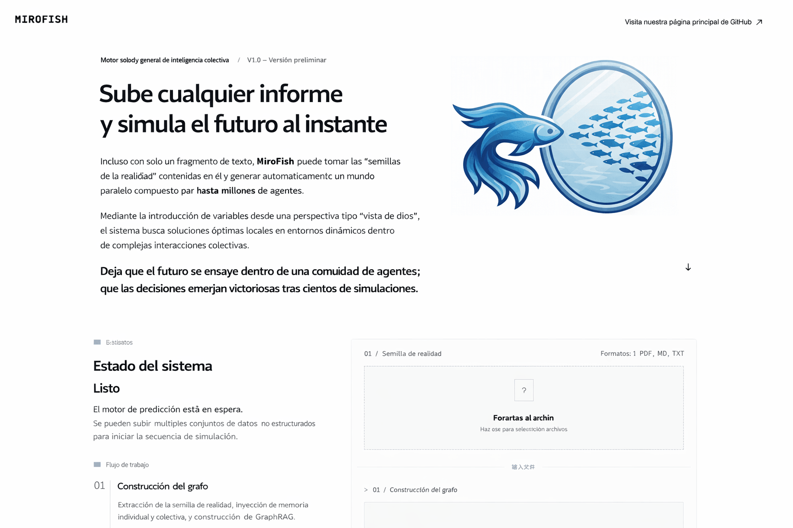
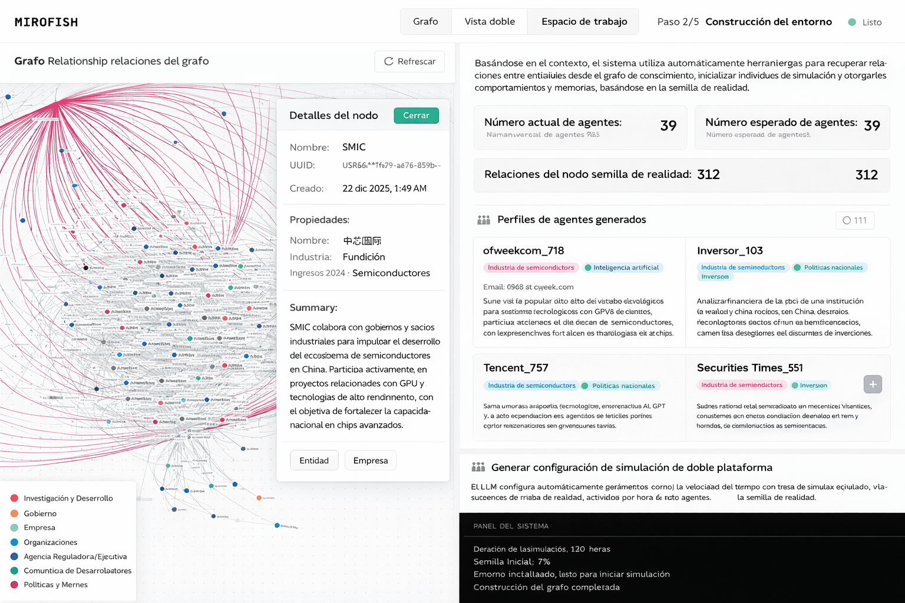
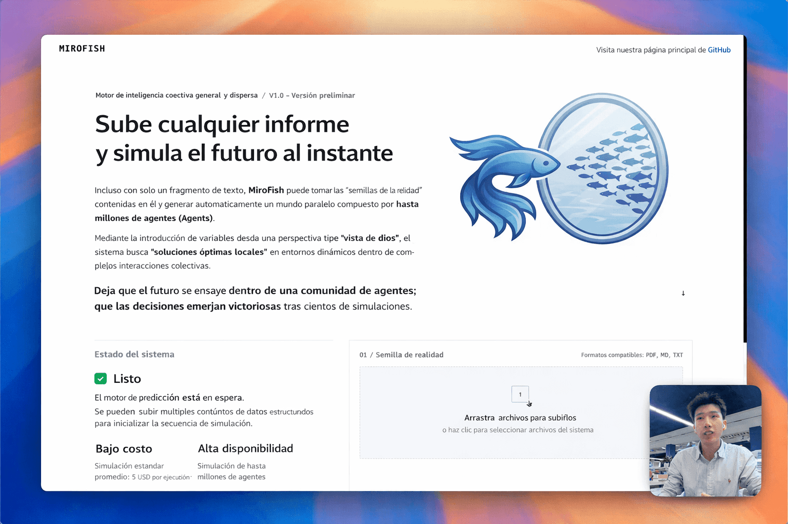
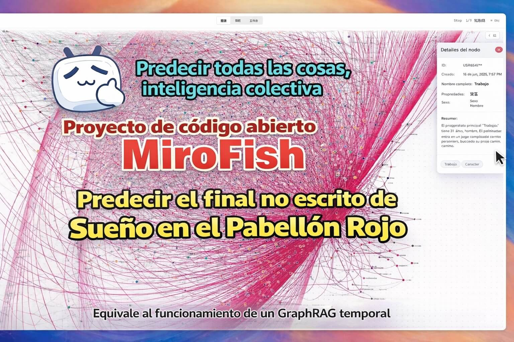

<div align="center">


<a href="https://trendshift.io/repositories/16144" target="_blank"></a>

Un motor de inteligencia de enjambre simple y universal, prediciendo todo
</br>
<em>A Simple and Universal Swarm Intelligence Engine, Predicting Anything</em>

<a href="https://www.shanda.com/" target="_blank"></a>

[](https://github.com/666ghj/MiroFish/stargazers)
[](https://github.com/666ghj/MiroFish/watchers)
[](https://github.com/666ghj/MiroFish/network)
[](https://hub.docker.com/)
[](https://deepwiki.com/666ghj/MiroFish)

[](http://discord.gg/ePf5aPaHnA)
[](https://x.com/mirofish_ai)
[](https://www.instagram.com/mirofish_ai/)

[Español](./README.md) | [English](./README-EN.md) | [中文文档](./README-ZH.md)

</div>

## ⚡ Descripción General

**MiroFish** es un motor de predicción con IA de nueva generación basado en tecnología multi-agente. Mediante la extracción de información semilla del mundo real (como noticias de última hora, borradores de políticas o señales financieras), construye automáticamente un mundo digital paralelo de alta fidelidad. En este espacio, miles de agentes inteligentes con personalidades independientes, memoria a largo plazo y lógica conductual interactúan libremente y evolucionan socialmente. Puedes inyectar variables dinámicamente desde una "perspectiva divina" para deducir con precisión las trayectorias futuras — **ensaya el futuro en una simulación digital, y toma decisiones ganadoras tras infinitas simulaciones**.

> Solo necesitas: Subir materiales semilla (informes de análisis de datos o historias de novelas interesantes) y describir tus requisitos de predicción en lenguaje natural</br>
> MiroFish devolverá: Un informe de predicción detallado y un mundo digital de alta fidelidad con el que puedes interactuar profundamente

### Nuestra Visión

MiroFish se dedica a crear un espejo de inteligencia de enjambre que mapea la realidad. Capturando la emergencia colectiva desencadenada por interacciones individuales, superamos las limitaciones de la predicción tradicional:

- **A nivel macro**: Somos un laboratorio de ensayo para tomadores de decisiones, permitiendo que políticas y relaciones públicas se prueben con riesgo cero
- **A nivel micro**: Somos una caja de arena creativa para usuarios individuales — ya sea deducir finales de novelas o explorar escenarios imaginativos, todo puede ser divertido, juguetón y accesible

Desde predicciones serias hasta simulaciones lúdicas, hacemos que cada "qué pasaría si" vea su resultado, haciendo posible predecir cualquier cosa.

## 🌐 Demo en Vivo

Visita nuestro entorno de demostración en línea y experimenta una simulación de predicción sobre eventos de opinión pública que hemos preparado para ti: [mirofish-live-demo](https://666ghj.github.io/mirofish-demo/)

## 📸 Capturas de Pantalla

<div align="center">
<table>
<tr>
<td></td>
<td></td>
</tr>
<tr>
<td></td>
<td></td>
</tr>
<tr>
<td></td>
<td></td>
</tr>
</table>
</div>

## 🎬 Videos de Demostración

### 1. Simulación de Opinión Pública de la Universidad de Wuhan + Introducción al Proyecto MiroFish

<div align="center">
<a href="https://www.bilibili.com/video/BV1VYBsBHEMY/" target="_blank"></a>

Haz clic en la imagen para ver el video completo de demostración de predicción usando el "Informe de Opinión Pública de la Universidad de Wuhan" generado por BettaFish
</div>

### 2. Simulación del Final Perdido de "Sueño en el Pabellón Rojo"

<div align="center">
<a href="https://www.bilibili.com/video/BV1cPk3BBExq" target="_blank"></a>

Haz clic en la imagen para ver la predicción profunda de MiroFish sobre el final perdido basada en cientos de miles de palabras de los primeros 80 capítulos de "Sueño en el Pabellón Rojo"
</div>

> **Predicción Financiera**, **Predicción de Noticias Políticas** y más ejemplos próximamente...

## 🔄 Flujo de Trabajo

1. **Construcción del Grafo**: Extracción de semillas & Inyección de memoria individual/colectiva & Construcción de GraphRAG
2. **Configuración del Entorno**: Extracción de relaciones de entidades & Generación de personas & Inyección de parámetros de simulación por Agent
3. **Simulación**: Simulación paralela de doble plataforma & Análisis automático de requisitos de predicción & Actualización dinámica de memoria temporal
4. **Generación de Informes**: ReportAgent con un rico conjunto de herramientas para interacción profunda con el entorno post-simulación
5. **Interacción Profunda**: Conversa con cualquier agente en el mundo simulado & Interactúa con ReportAgent

## 🧠 Backends de Memoria

MiroFish soporta dos backends de almacenamiento de memoria para el grafo de conocimiento:

### 1. Zep Cloud (Por defecto)
Servicio cloud de gestión de memoria con funcionalidad de grafo integrada.

**Ventajas:**
- Sin necesidad de configuración local
- Escalado automático
- API ready-to-use

**Configuración:**
```env
MEMORY_BACKEND=zep  # Por defecto, puede omitirse
ZEP_API_KEY=tu_zep_api_key
```

Requiere solo una clave API de Zep Cloud: https://app.getzep.com/

### 2. Graphiti (Local)
Backend local usando Neo4j con Graphiti para extracción avanzada de entidades.

**Ventajas:**
- Control total de datos (offline/local)
- Sin dependencias de servicios externos
- Extracción de entidades LLM-powered

**Configuración:**
```env
MEMORY_BACKEND=graphiti
NEO4J_URI=bolt://localhost:7687
NEO4J_USER=neo4j
NEO4J_PASSWORD=mirofish2024
```

**Iniciar Neo4j con Docker:**
```bash
docker compose -f docker/graphiti/docker-compose.yml up -d
```

Neo4j UI estará disponible en `http://localhost:7474` (usuario: `neo4j`, contraseña: `mirofish2024`)

## 🚀 Inicio Rápido

### Opción 1: Despliegue desde Código Fuente (Recomendado)

#### Requisitos Previos

| Herramienta | Versión | Descripción | Verificar Instalación |
|-------------|---------|-------------|----------------------|
| **Node.js** | 18+ | Entorno de ejecución frontend, incluye npm | `node -v` |
| **Python** | ≥3.11, ≤3.12 | Entorno de ejecución backend | `python --version` |
| **uv** | Última | Gestor de paquetes Python | `uv --version` |

#### 1. Configurar Variables de Entorno

```bash
# Copiar el archivo de configuración de ejemplo
cp .env.example .env

# Editar el archivo .env e introducir las claves API necesarias
```

**Variables de Entorno Requeridas:**

```env
# Configuración de API LLM (soporta cualquier API LLM con formato OpenAI SDK)
# Recomendado: Modelo Qwen-plus de Alibaba via Plataforma Bailian: https://bailian.console.aliyun.com/
# Alto consumo, primero prueba simulaciones con menos de 40 rondas
LLM_API_KEY=tu_api_key
LLM_BASE_URL=https://dashscope.aliyuncs.com/compatible-mode/v1
LLM_MODEL_NAME=qwen-plus

# Configuración de Zep Cloud
# La cuota mensual gratuita es suficiente para uso simple: https://app.getzep.com/
ZEP_API_KEY=tu_zep_api_key
```

#### 2. Instalar Dependencias

```bash
# Instalación con un solo clic de todas las dependencias (raíz + frontend + backend)
npm run setup:all
```

O instalar paso a paso:

```bash
# Instalar dependencias Node (raíz + frontend)
npm run setup

# Instalar dependencias Python (backend, crea automáticamente el entorno virtual)
npm run setup:backend
```

#### 3. Iniciar Servicios

```bash
# Iniciar frontend y backend simultáneamente (ejecutar desde la raíz del proyecto)
npm run dev
```

**URLs de Servicio:**
- Frontend: `http://localhost:3000`
- Backend API: `http://localhost:5001`

**Iniciar Individualmente:**

```bash
npm run backend   # Iniciar solo el backend
npm run frontend  # Iniciar solo el frontend
```

### Opción 2: Despliegue con Docker

```bash
# 1. Configurar variables de entorno (igual que despliegue desde fuente)
cp .env.example .env

# 2. Descargar imagen e iniciar
docker compose up -d
```

Lee el archivo `.env` desde el directorio raíz por defecto, mapea los puertos `3000 (frontend) / 5001 (backend)`

> Se proporciona una dirección mirror para descarga más rápida como comentarios en `docker-compose.yml`, reemplaza si es necesario.

### Scripts de Utilidad

Para un flujo de desarrollo más conveniente, proporcionamos scripts de inicio/detención:

**Linux/Mac:**
```bash
# Iniciar todo (detecta backend de memoria automáticamente)
./scripts/iniciar.sh

# Detener todo
./scripts/detener.sh
```

**Windows (CMD/PowerShell):**
```bash
# Iniciar
scripts\iniciar.bat

# Detener
scripts\detener.bat
```

**Características del script `iniciar.sh/bat`:**
- Detecta el backend de memoria configurado (`MEMORY_BACKEND`)
- Si es `graphiti`: inicia Neo4j con Docker automáticamente
- Limpia procesos residuales de ejecuciones anteriores
- Muestra URLs de servicio (Frontend, Backend, Neo4j UI si aplica)
- Manejo limpio de `Ctrl+C` para detener todo

**Configuración del backend de memoria:**
```env
# Backend de memoria a usar: "zep" (por defecto) o "graphiti"
MEMORY_BACKEND=graphiti
```

## 📬 Únete a la Conversación

<div align="center">

</div>

&nbsp;

El equipo de MiroFish está contratando personal a tiempo completo y pasantes. Si te interesa la simulación multi-agente y las aplicaciones de LLM, envía tu CV a: **mirofish@shanda.com**

## 📄 Agradecimientos

**¡MiroFish ha recibido apoyo estratégico e incubación de Shanda Group!**

El motor de simulación de MiroFish está potenciado por **[OASIS (Open Agent Social Interaction Simulations)](https://github.com/camel-ai/oasis)**. ¡Agradecemos sinceramente al equipo de CAMEL-AI por sus contribuciones de código abierto!

## 📈 Estadísticas del Proyecto

<a href="https://www.star-history.com/#666ghj/MiroFish&type=date&legend=top-left">
 <picture>
   <source media="(prefers-color-scheme: dark)" srcset="https://api.star-history.com/svg?repos=666ghj/MiroFish&type=date&theme=dark&legend=top-left" />
   <source media="(prefers-color-scheme: light)" srcset="https://api.star-history.com/svg?repos=666ghj/MiroFish&type=date&legend=top-left" />
   
 </picture>
</a>